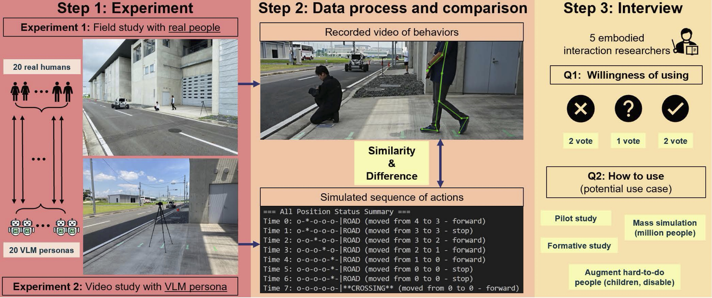
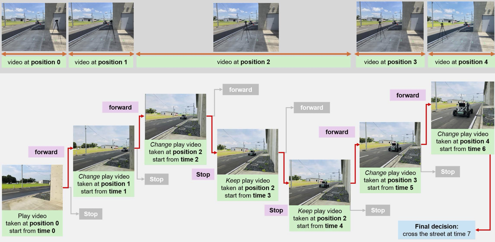
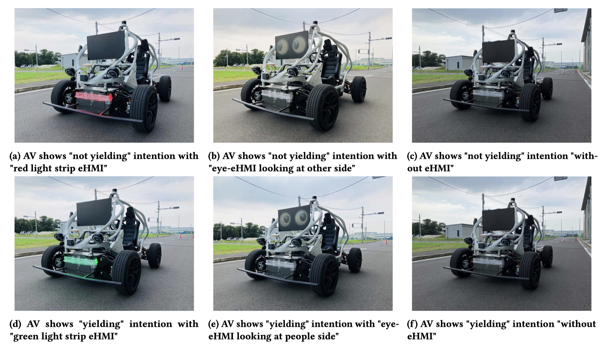

# [CHI2026] Peeking Ahead of the Field Study: Exploring VLM Personas as Support Tools for Embodied Studies in HCI

Accepted at CHI 2026 · Barcelona, Spain

> Gui, X., Xia, D., Colley, M., Li, Y., Chauhan, V., Anubhav, A., Zhou, Z., Javanmardi, E., Seo, S. H., Chang, C.-M., Tsukada, M., & Igarashi, T. (2026). Peeking Ahead of the Field Study: Exploring VLM Personas as Support Tools for Embodied Studies in HCI. *CHI '26*. <https://doi.org/10.1145/3772318.3790537>

---



## What is this?

Field studies are irreplaceable but costly and error-prone. This project proposes using **Vision-Language Model (VLM) personas** as low-cost proxy participants to preview field study outcomes before running them with real people.

We conducted two parallel studies on a **street-crossing task** in the presence of an autonomous vehicle (AV):

1. A real-world field study with **20 human participants**
2. A video-based simulation using **20 VLM personas** modeled after them

---

## How the Simulator Works



The core idea is a **choice-based video simulator** inspired by branching video games:

- **5 spatial positions** (0.8 m apart) from sidewalk to road edge
- **Up to 8 time steps** (1 second each)
- At each step, the VLM persona chooses: `forward` · `stop` · `backward`
- The simulator plays the video clip matching the current `position × time` state

This produces a full decision trajectory that can be compared directly to human behavior.

---

## Video Scenarios



**Download:** [250722_real_sim.zip (Google Drive)](https://drive.google.com/file/d/1X1GADttz9uKdtgKt5t1O3QgM97qjEtyP/view?usp=sharing) — unzip into `data/`

Six scenarios are provided under `data/250722_real_sim/`, covering **3 eHMI types × 2 AV behaviors**:

| Folder | eHMI | AV behavior |
|--------|------|-------------|
| `eye_pass` | Animated eyes (looking away) | Pass without yielding |
| `eye_stop` | Animated eyes (looking at pedestrian) | Stop and yield |
| `lightbar_green` | Green light strip | Stop and yield |
| `lightbar_red` | Red light strip | Pass without yielding |
| `no-ehmi_pass` | No eHMI | Pass without yielding |
| `no-ehmi_stop` | No eHMI | Stop and yield |

Each scenario contains **45 one-second video clips** (`posP_timeT.mp4`) in its `split/` subfolder.

---

## Installation

**Requirements:** Python 3.11, [Poetry](https://python-poetry.org/)

```bash
# 1. Clone the repository
git clone https://github.com/ApisXia/PersonaVLM.git
cd PersonaVLM

# 2. Create and activate a conda environment
conda create -n personavlm python=3.11
conda activate personavlm

# 3. Install dependencies
pip install poetry
poetry install --no-root

# 4. Download the video data
# Download 250722_real_sim.zip from:
# https://drive.google.com/file/d/1X1GADttz9uKdtgKt5t1O3QgM97qjEtyP/view?usp=sharing
# Then unzip it into the data/ folder:
unzip 250722_real_sim.zip -d data/
# Expected result: data/250722_real_sim/<scenario>/split/*.mp4

# 5. Set up your API key
cp configs/base_config_template.yaml configs/base_config.yaml
# Then open configs/base_config.yaml and paste your OpenAI API key
```

`configs/base_config.yaml` structure:
```yaml
openai_api_key: "sk-..."   # Your OpenAI API key

vlm_models:
  decision_model: "gpt-4.1"          # Model used for step-by-step decisions
  questionnaire_model: "gpt-4.1-mini" # Model used for post-simulation questionnaire
  decision_max_tokens: 500
  questionnaire_max_tokens: 800
```

Supported models: `gpt-4o`, `gpt-4o-mini`, `gpt-4.1`, `gpt-4.1-mini`, `gpt-4.1-nano`

---

## Running the Simulation

### Option A — Gradio Web UI (Recommended)

```bash
python street_crossing_simu_app.py
```

Then open **<http://127.0.0.1:7860>** in your browser.

The UI lets you:

- Select a **persona file** and a specific **persona** from the dropdown
- Choose a **video scenario** (6 options) and **eHMI type**
- Set **max time steps** (default: 12) and **temperature** (default: 1.2)
- Click **▶ Run Simulation** — results stream in real time
- Click any **step in the history list** or any **node in the decision flow diagram** to replay that moment's video and reasoning

### Option B — Command Line

```bash
python street_crossing_decision_command.py
```

Follow the interactive prompts to select persona, scenario, and parameters. Results and videos are saved to `out/<scenario>/simulation_<timestamp>/`.

---

## Persona Files

Personas are stored in `personas/` as JSON files. Each persona has three fields:

```json
{
  "persona_id": {
    "name": "G3x03g",
    "description": "Demographics and behavioral tendencies when crossing a street...",
    "decision_criteria": [
      "Impression of autonomous driving: ...",
      "Use case: ...",
      "Emotion: ...",
      "Concern: ...",
      "Expectation: ..."
    ]
  }
}
```

Personas are constructed from participant questionnaire data (Big Five personality traits + AV experience) using the two-step **filter → transfer** prompt pipeline described in the paper (Section 5.1).

To add your own persona, add a new entry to an existing JSON file or create a new `.json` file in `personas/`.

---

## Project Structure

```text
PersonaVLM/
├── street_crossing_simu_app.py        # Gradio web UI (main entry point)
├── street_crossing_decision_command.py # Command-line runner + core system class
├── configs/
│   ├── base_config.yaml               # Your API key and model config (git-ignored)
│   └── base_config_template.yaml      # Template — copy this to base_config.yaml
├── prompts/
│   ├── prompt_loader.py               # Loads all prompt templates
│   ├── simulation/
│   │   ├── system_prompt.txt          # Persona + task context injected at t=0
│   │   ├── user_prompt.txt            # Per-step decision prompt
│   │   └── history_format.txt         # Format for decision history
│   └── questionnaire/
│       ├── system_prompt.txt          # Post-simulation questionnaire system prompt
│       └── user_prompt.txt            # Post-simulation questionnaire user prompt
├── personas/
│   └── persona_improvetransfer_v04.json  # 20 VLM personas from the paper
├── data/
│   └── 250722_real_sim/               # Video scenarios
│       ├── eye_pass/split/            # 45 clips: pos{0-4}_time{0-8}.mp4
│       ├── eye_stop/split/
│       ├── lightbar_green/split/
│       ├── lightbar_red/split/
│       ├── no-ehmi_pass/split/
│       └── no-ehmi_stop/split/
└── out/                               # Simulation outputs (auto-created)
    └── <scenario>/simulation_<timestamp>/
        ├── simulation_log.json        # Full decision log
        ├── step_views/                # Video clip for each step
        └── all_agent_see.mp4          # Combined video of the full run
```

---

## Citation

```bibtex
@inproceedings{gui2026personavlm,
  title     = {Peeking Ahead of the Field Study: Exploring VLM Personas as Support Tools for Embodied Studies in HCI},
  author    = {Gui, Xinyue and Xia, Ding and Colley, Mark and Li, Yuan and Chauhan, Vishal and Anubhav, Anubhav and Zhou, Zhongyi and Javanmardi, Ehsan and Seo, Stela Hanbyeol and Chang, Chia-Ming and Tsukada, Manabu and Igarashi, Takeo},
  booktitle = {Proceedings of the 2026 CHI Conference on Human Factors in Computing Systems},
  year      = {2026},
  publisher = {ACM},
  doi       = {10.1145/3772318.3790537}
}
```

---

## Acknowledgements

This work was supported by JST CRONOS, Grant Number JPMJCS24K8, Japan. Mark Colley was supported by a Canon Research Fellowship.
